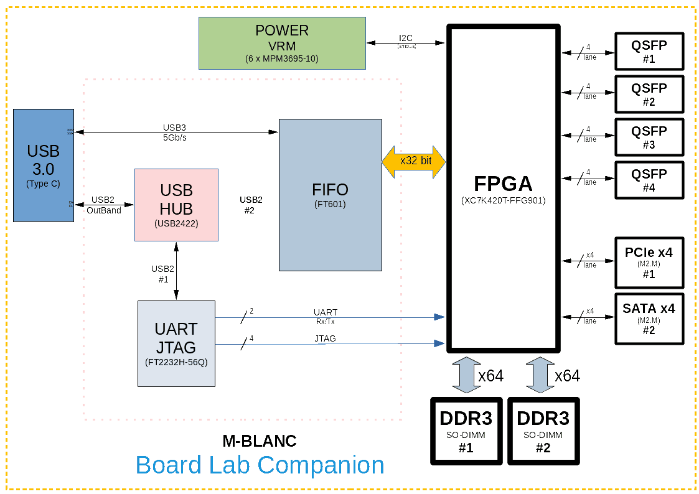
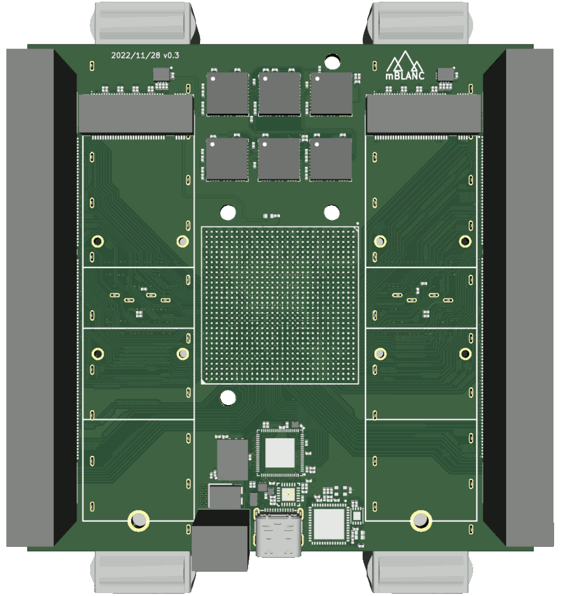
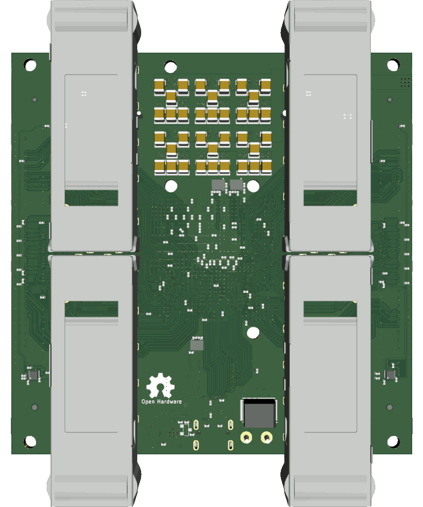
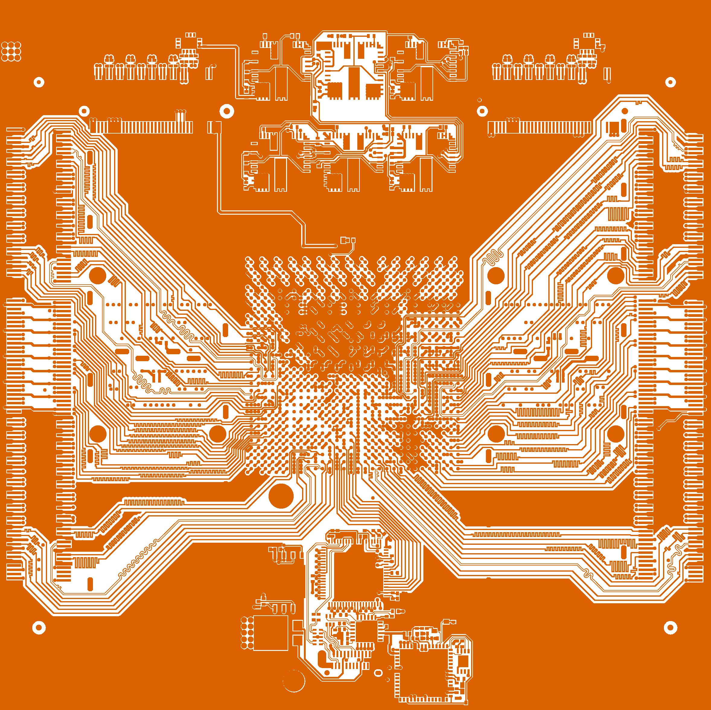
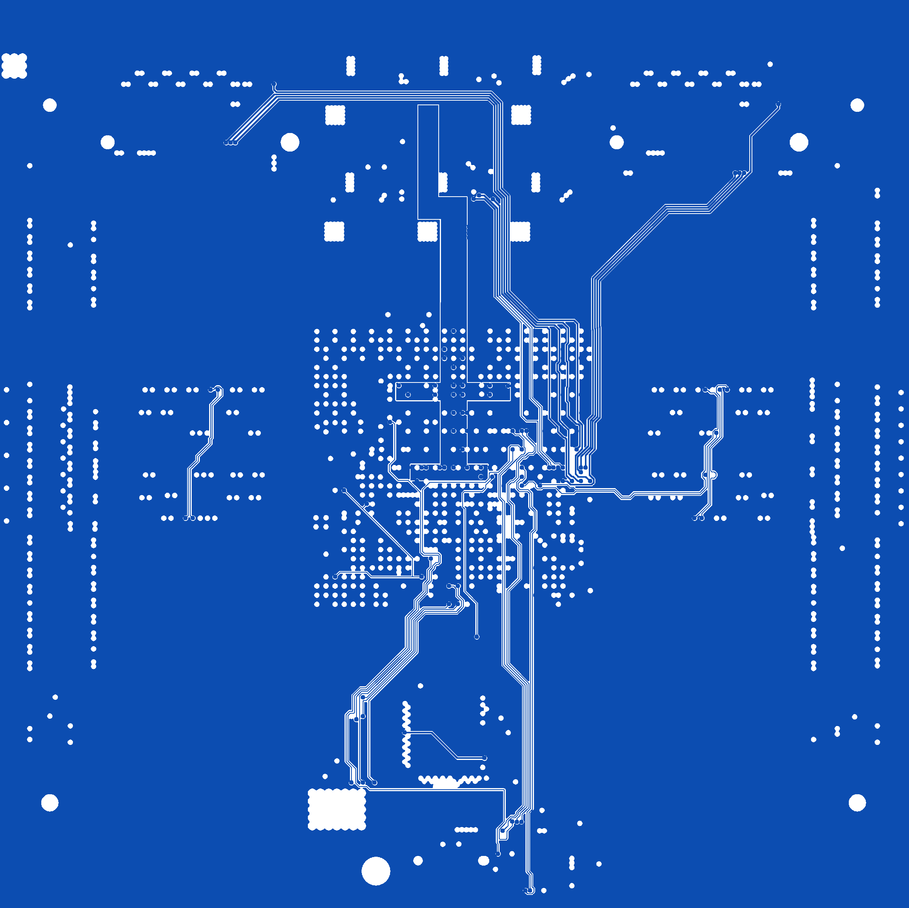
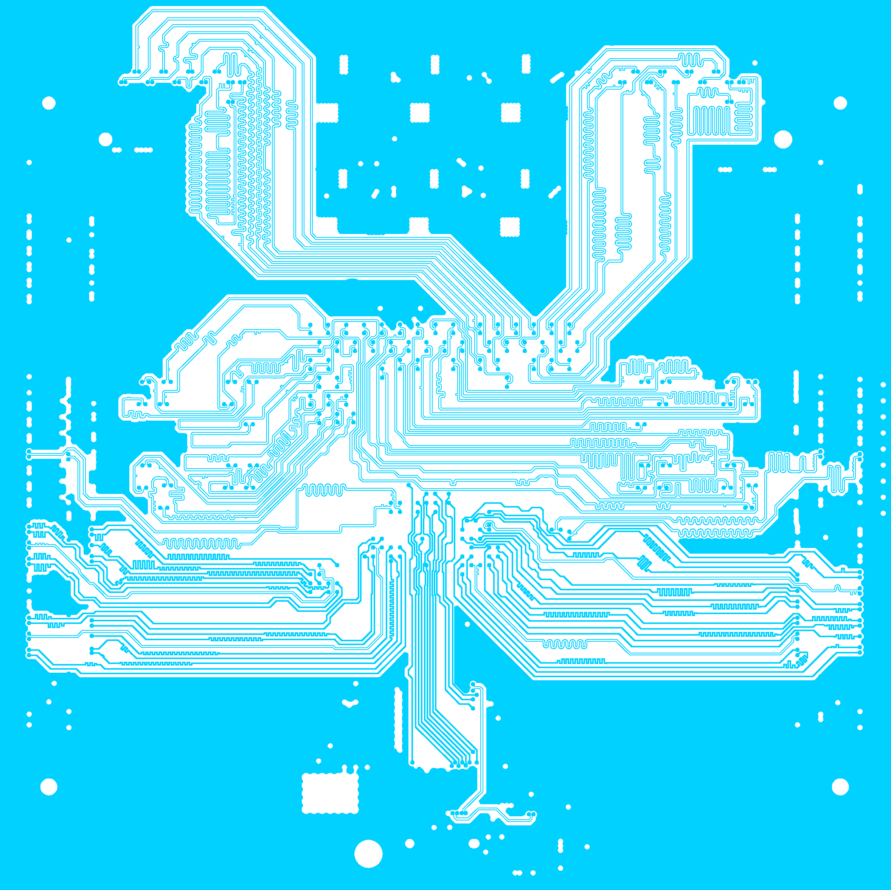
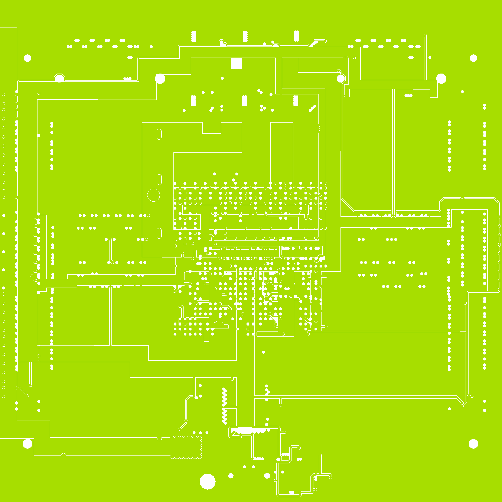
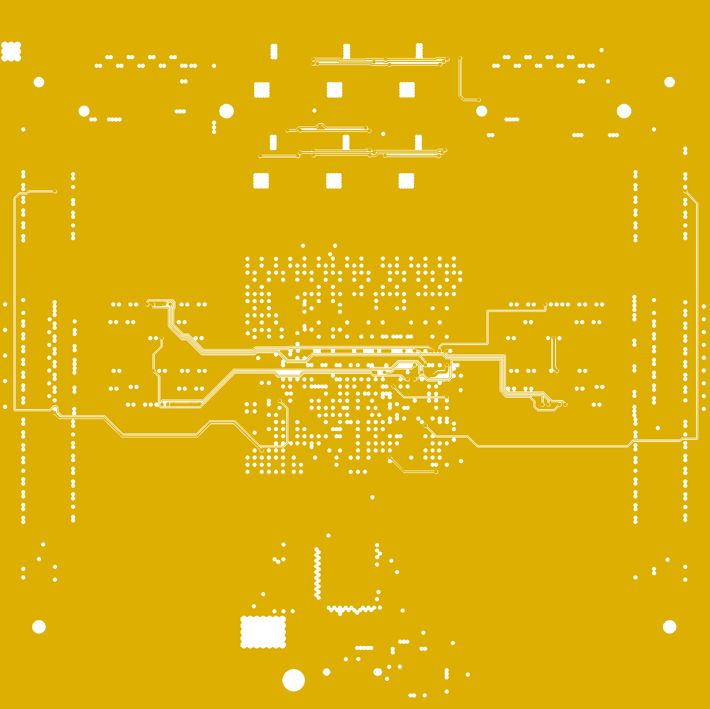
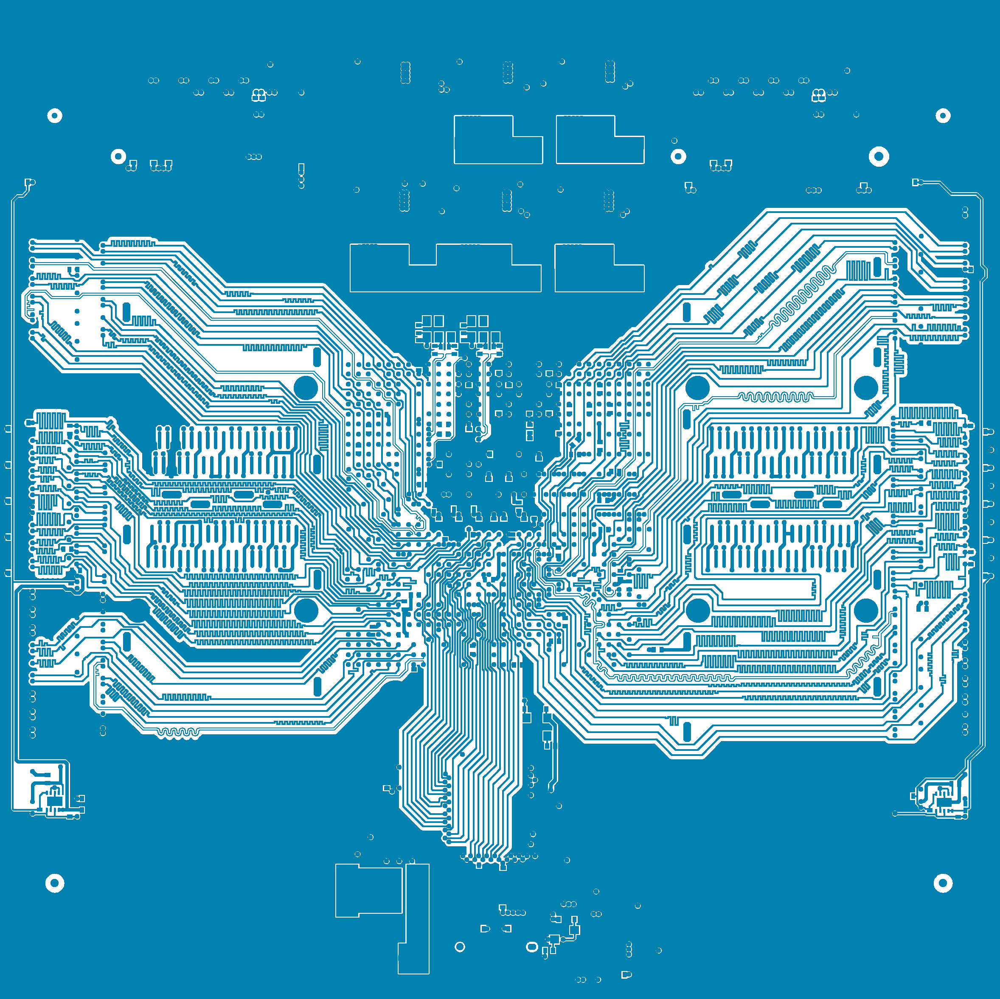

**m**ini **B**oard **LA**b a**n**d **C**ompanion



## Description

  With the rising of high quality opensource tools for FPGAs new opportunities are emerging to discover and build better digital architectures.
  This board is intended to explore & research the world of modern digital systems that requires large memory bus and high-speed peripherials.

## Specs:

* Large **xc7k420t** **FPGA** design space
* Two **DDR3 SO-DIMM** sockets having **128 (2 x 64) bits** wide access
* USB3 **5Gbps/s** data access over **x32** wide independent FIFO
* USB2 outband (same usb port) permanent **JTAG** and **UART** independent access
* Two  **M.2** (M-key), 4 x SERDes lanes each, PCIe & SATA mappable
* Four **QSFP** sockets 4 x SERDes lanes each, with up to 10Gb/s line rates

Can be used in any USB port right from the tips of fingers, no cables, no wires but full control.

|               TOP                   |               BOTTOM                   |
| ----------------------------------- | -------------------------------------- |
|||

## Progress:

* ```17-Aug-2021``` Initial design and PCB prototype is done.
* ```22-Nov-2022``` Updated design having first PCB samples.

## Project files

* Open Source Hardware 
* Check [schematic](hardware/m-BLANC-v0_3.pdf) available as quick readable document.
* See the [design files](hardware) available for Altium ®, CircuitMaker ®, KiCAD and Gerber format.


## PCB views

| Layer    | Desc |             Image                | Layer    | Desc |              Image               |
| -------- | ---- | -------------------------------- | -------- | ---- | -------------------------------- |
|**Top**   |Signal||**Inner1**|GND   |  |
|**Inner2**|Signal|  |**Inner3**|Power |  |
|**Inner4**|GND   |  |**Bottom**|Signal||
